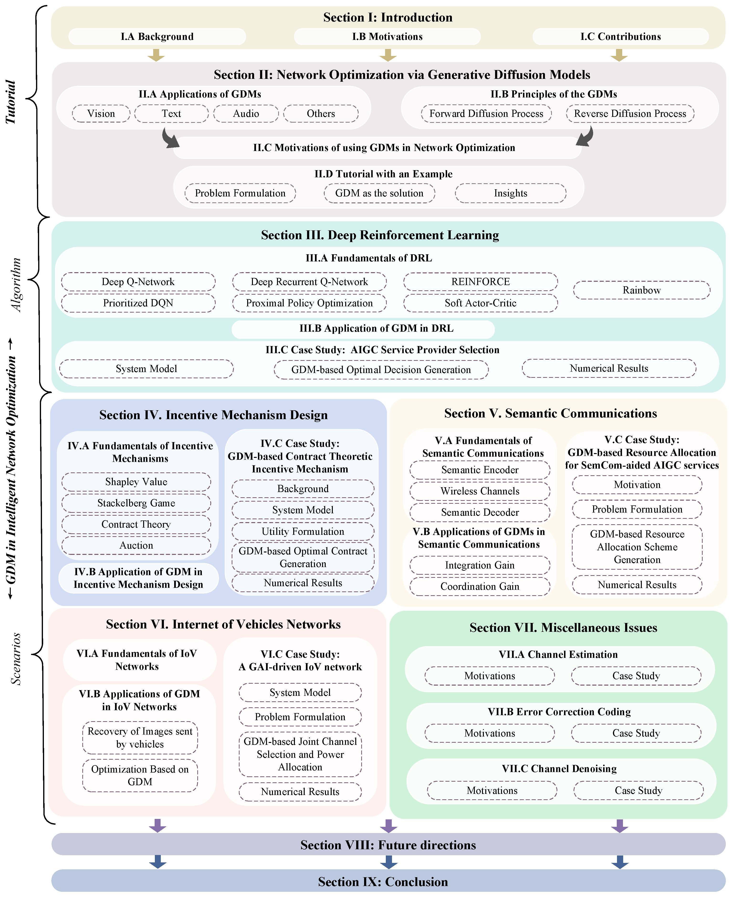
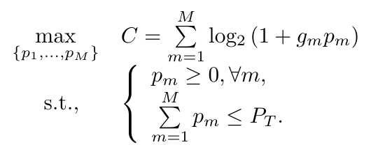

# Beyond Deep Reinforcement Learning: A Tutorial on Generative Diffusion Models in Network Optimization

Generative Diffusion Models (GDMs) have emerged as a transformative force in the realm of Generative Artificial Intelligence (GAI), demonstrating their versatility and efficacy across a variety of applications. The ability to model complex data distributions and generate high-quality samples has made GDMs particularly effective in tasks such as image generation and reinforcement learning. Furthermore, their iterative nature, which involves a series of noise addition and denoising steps, is a powerful and unique approach to learning and generating data.

This repository contains the code accompanying the paper 

> **"Beyond Deep Reinforcement Learning: A Tutorial on Generative Diffusion Models in Network Optimization"**

Authored by *Hongyang Du, Ruichen Zhang, Yinqiu Liu, Jiacheng Wang, Yijing Lin, Zonghang Li, Dusit Niyato, Jiawen Kang, Zehui Xiong, Shuguang Cui, Bo Ai, Haibo Zhou, and Dong In Kim*, submitted to *IEEE Communications Surveys & Tutorials*.

The paper can be found at [ArXiv](https://arxiv.org/abs/2308.05384).

## ⚡ Structure of Our Tutorial


We initiate our discussion with the foundational knowledge of GDM and the motivation behind their applications in network optimization. This is followed by exploring GDM’s wide applications and fundamental principles and a comprehensive tutorial outlining the steps for using GDM in network optimization. In the context of intelligent networks, we study the impact of GDM on algorithms, e.g., **Deep Reinforcement Learning (DRL)**, and its implications for key scenarios, e.g., **incentive mechanism design**, **Semantic Communications(SemCom)**, **Internet of Vehicles (IoV) networks**, channel estimation, error correction coding, and channel denoising. We conclude our tutorial by discussing potential future research directions and summarizing the key contributions.

## ⚡ Network Optimization via Generative Diffusion Models


GDM training approaches with and without an expert dataset. **Part A** illustrates the GDM training scenario when an expert database is accessible. The process learns from the GDM applications in the image domain: the optimal solution is retrieved from the expert database upon observing an environmental condition, followed by the GDM learning to replicate this optimal solution through forward diffusion and reverse denoising process. **Part B** presents the scenario where no expert database exists. In this case, GDM, with the assistance of a jointly trained solution evaluation network, learns to generate the optimal solution for a given environmental condition by actively exploring the unknown environment.

---

## 🔧 Tutorial with an Example

In this part, we representatively formulate an optimization problem in a wireless network and show a step-bystep tutorial to solve it by using GDMs.

Consider a wireless communication network where a base station with total power *P_T* serves a set of users over multiple orthogonal channels. The objective is to **maximize the sum rate** of all channels by optimally allocating power among the channels. Let *g_n* denote the channel gain for the *n_th* channel and *p_n* denote the power allocated to that channel. The sum rate of all *M* orthogonal channels is given by the sum of their individual rates. Let the noise level be set as *1* without loss of generality for the analysis. The optimization goal is to find the power allocation scheme \{*p_1*, ..., *p_M*\} that maximizes the sum rate *C* under the power budget and the non-negativity constraints as:



The dynamic nature of the wireless environment presents a significant challenge, as the values of the channel gains, denoted as \{*g_1*, ..., *g_M*\}, can fluctuate within a range. Therefore, our objective is, **given a set of environmental variables as a condition, to use GDM to denoise the Gaussian noise into the corresponding optimal power allocation scheme under this condition.**

Here, we consider *M= 100*. Specifically, the first 50 channels are in good quality and the last channels are in deep fadings.
```bash
    def state(self):
        # Provide the current state to the agent
        states1 = np.random.uniform(13, 14, 50)
        states2 = np.random.uniform(0, 0.1, 50)
        states = np.concatenate([states1, states2])
        self._laststate = states
        return states
```


## ⚡ Activate Coding Environment

To create a new conda environment, execute the following command:

```bash
conda create --name gdmopt python==3.8
```


Activate the created environment with:

```bash
conda activate gdmopt
```

## 📦 Install Required Packages

The following package can be installed using pip:

```bash
pip install tianshou==0.4.11
pip install matplotlib==3.7.3
pip install scipy==1.10.1
```

## 🏃‍♀️ Run the Program

Run `main.py` in the file `Main` to start the program.

*A.* For the case that an expert database is accessible, in main.py, please set
```bash
parser.add_argument('--expert-coef', default=True)
```

In env/utility.py, please set
```bash
actions = torch.abs(actions)
```

*B.* For the scenario where no expert database exists, in main.py, please set
```bash
parser.add_argument('--expert-coef', default=False)
```
In env/utility.py, please set
```bash
actions = torch.sigmod(actions)
```

## 🔍 Check the results

When is model is training, the following command can be used for checking:
```bash
tensorboard --logdir .
```


After the model is well trained, the following command can be used for inference:
```bash
python main.py --watch --resume-path log/default/diffusion/Jul10-142653/policy.pth
```


*Note that the power allocation problem we consider here is a highly simplified one. In such cases, the performance of GDM is not always superior to DRL. For more realistic optimization problems (such as decision problems involving state transitions), considering combining GDM with DRL could be worthwhile, as is explored in our D2SAC work:*

---

## Citation
If our diffusion based method can be used in your paper, please help cite:
```bibtex
@article{du2023beyond,
  title={Beyond Deep Reinforcement Learning: A Tutorial on Generative Diffusion Models in Network Optimization},
  author={Authors},
  journal={},
  year={2023},
  publisher={IEEE}
}
```

## Technical papers that used our method
```bibtex
@article{du2023user,
  title={User-Centric Interactive AI for Distributed Diffusion Model-based AI-Generated Content},
  author={Du, Hongyang and Zhang, Ruichen and Niyato, Dusit and Kang, Jiawen and Xiong, Zehui and Cui, Shuguang and Shen, Xuemin and Kim, Dong In},
  journal={arXiv preprint arXiv:2311.11094},
  year={2023}
}
```
```bibtex
@article{du2023ai,
  title={AI-generated incentive mechanism and full-duplex semantic communications for information sharing},
  author={Du, Hongyang and Wang, Jiacheng and Niyato, Dusit and Kang, Jiawen and Xiong, Zehui and Kim, Dong In},
  journal={IEEE Journal on Selected Areas in Communications},
  year={2023},
  publisher={IEEE}
}
```
```bibtex
@article{du2023generative,
  title={Generative AI-aided Joint Training-free Secure Semantic Communications via Multi-modal Prompts},
  author={Du, Hongyang and Liu, Guangyuan and Niyato, Dusit and Zhang, Jiayi and Kang, Jiawen and Xiong, Zehui and Ai, Bo and Kim, Dong In},
  journal={arXiv preprint arXiv:2309.02616},
  year={2023}
}
```
```bibtex
@article{wang2023unified,
  title={A Unified Framework for Guiding Generative AI with Wireless Perception in Resource Constrained Mobile Edge Networks},
  author={Wang, Jiacheng and Du, Hongyang and Niyato, Dusit and Kang, Jiawen and Xiong, Zehui and Rajan, Deepu and Mao, Shiwen and others},
  journal={arXiv preprint arXiv:2309.01426},
  year={2023}
}
```
```bibtex
@article{du2023yolo,
  title={YOLO-based Semantic Communication with Generative AI-aided Resource Allocation for Digital Twins Construction},
  author={Du, Baoxia and Du, Hongyang and Liu, Haifeng and Niyato, Dusit and Xin, Peng and Yu, Jun and Qi, Mingyang and Tang, You},
  journal={arXiv preprint arXiv:2306.14138},
  year={2023}
}
```
```bibtex
@article{du2023diffusion,
  title={Diffusion-based Reinforcement Learning for Edge-enabled AI-Generated Content Services},
  author={Du, Hongyang and Li, Zonghang and Niyato, Dusit and Kang, Jiawen and Xiong, Zehui and Huang, Huawei and Mao, Shiwen},
  journal={Authorea Preprints},
  year={2023},
  publisher={arXiv preprint arXiv:2303.13052}
}
```